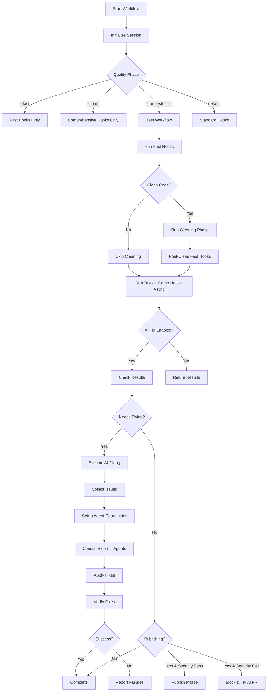

# Crackerjack Auto-Fix Architecture Analysis

## Executive Summary

This document provides a comprehensive analysis of the crackerjack quality tool's auto-fix workflow design, including its architecture, integration points, configuration requirements, and identification of missing pieces preventing full auto-fix functionality.

**Project Location:** `/Users/les/Projects/crackerjack/`

**Key Finding:** The `--ai-fix` flag exists and is fully integrated into the workflow, but the AI-powered fixing workflow relies on external Claude Code agents for actual code modifications. The system has a complete iterative framework but requires proper agent configuration and API access to function.

---

## 1. ACB Architecture Overview

### Core Framework Structure

Crackerjack is built on ACB (Asynchronous Component Base) patterns with the following key components:

```
crackerjack/
├── core/
│   ├── workflow_orchestrator.py     # Main workflow pipeline
│   ├── autofix_coordinator.py       # Simple tool-based fixes (ruff, bandit)
│   ├── phase_coordinator.py         # Phase execution management
│   ├── session_coordinator.py       # Session tracking
│   └── enhanced_container.py        # Dependency injection container
├── agents/
│   ├── enhanced_coordinator.py      # AI agent orchestration
│   ├── coordinator.py               # Base agent coordination
│   ├── claude_code_bridge.py        # External agent integration
│   └── base.py                      # Agent context & issue models
├── cli/
│   ├── options.py                   # CLI options including --ai-fix
│   └── handlers.py                  # CLI handlers & env setup
└── services/                        # Supporting services
```

### Adapter System Integration

Crackerjack doesn't define custom ACB adapters but uses:
- **Dependency Injection:** `enhanced_container.py` creates DI container for services
- **Service Layer:** Hook managers, test managers, Git services
- **Protocol-based interfaces:** Clean separation of concerns

---

## 2. Auto-Fix Workflow Architecture

### Two-Tier Fix System

#### Tier 1: Tool-Based Fixes (`AutofixCoordinator`)

**Purpose:** Simple, fast fixes using standard tools
**Location:** `crackerjack/core/autofix_coordinator.py`

```python
class AutofixCoordinator:
    def apply_autofix_for_hooks(self, mode: str, hook_results: list[object]) -> bool:
        if mode == "fast":
            return self._apply_fast_stage_fixes()
        elif mode == "comprehensive":
            return self._apply_comprehensive_stage_fixes(hook_results)
```

**Fast Stage Fixes:**
```python
fixes = [
    (["uv", "run", "ruff", "format", "."], "format code"),
    (["uv", "run", "ruff", "check", "--fix", "."], "fix code style"),
]
```

**Comprehensive Stage Fixes:**
- Bandit for security issues
- Hook-specific fixes based on failures

**Key Characteristics:**
- ✅ Simple subprocess-based execution
- ✅ Pattern matching for success indicators
- ✅ Security validation (only allows `uv run` commands with whitelisted tools)
- ❌ No iterative loops
- ❌ No code generation/modification

#### Tier 2: AI-Powered Fixes (`EnhancedAgentCoordinator`)

**Purpose:** Complex fixes requiring code understanding and generation
**Location:** `crackerjack/agents/enhanced_coordinator.py`

```python
class EnhancedAgentCoordinator(AgentCoordinator):
    """AgentCoordinator enhanced with Claude Code external agent integration"""

    async def handle_issues_proactively(self, issues: list[Issue]) -> FixResult:
        # 1. Pre-analyze for external consultation
        strategic_consultations = await self._pre_consult_for_strategy(issues)

        # 2. Create architectural plan with external guidance
        architectural_plan = await self._create_enhanced_architectural_plan(
            issues, strategic_consultations
        )

        # 3. Apply fixes with enhanced strategy
        overall_result = await self._apply_enhanced_fixes_with_plan(
            issues, architectural_plan, strategic_consultations
        )

        # 4. Post-validate with external agents
        validated_result = await self._validate_with_external_agents(
            overall_result, architectural_plan
        )
```

**Available External Agents:**
- `crackerjack-architect` - Strategic planning & patterns
- `python-pro` - Python-specific fixes
- `security-auditor` - Security issue resolution
- `refactoring-specialist` - Code refactoring
- `crackerjack-test-specialist` - Test fixes

---

## 3. Workflow Orchestration Flow

### Main Pipeline (`WorkflowPipeline.run_complete_workflow`)



### Detailed AI Fixing Phase

**Entry Point:** `WorkflowPipeline._run_ai_agent_fixing_phase()`

```python
async def _run_ai_agent_fixing_phase(self, options: OptionsProtocol) -> bool:
    # 1. Initialize phase
    self._update_mcp_status("ai_fixing", "running")

    # 2. Prepare environment (run cleaning if needed)
    self._prepare_ai_fixing_environment(options)

    # 3. Setup coordinator and collect issues
    agent_coordinator = self._setup_agent_coordinator()
    issues = await self._collect_issues_from_failures()

    # 4. Execute fixes via AI agents
    fix_result = await agent_coordinator.handle_issues(issues)

    # 5. Verify fixes applied correctly
    verification_success = await self._verify_fixes_applied(options, fix_result)

    # 6. Return final success status
    return fix_result.success and verification_success
```

**Issue Collection Sources:**
1. **Test Failures** - From `test_manager.get_test_failures()`
2. **Hook Failures** - From `hook_manager.run_comprehensive_hooks()`

**Issue Classification:**
```python
IssueType.TYPE_ERROR       # Pyright failures
IssueType.SECURITY         # Bandit security issues
IssueType.COMPLEXITY       # Complexipy violations
IssueType.REGEX_VALIDATION # Regex pattern issues
IssueType.FORMATTING       # Code formatting
IssueType.DEAD_CODE        # Vulture dead code
IssueType.PERFORMANCE      # Refurb suggestions
IssueType.IMPORT_ERROR     # Import issues
IssueType.TEST_FAILURE     # Test failures
```

**Verification Loop:**
```python
async def _verify_fixes_applied(self, options, fix_result) -> bool:
    if not fix_result.fixes_applied:
        return True

    # Re-run tests if test fixes were applied
    if self._should_verify_test_fixes(fix_result.fixes_applied):
        test_success = self.phases.run_testing_phase(options)

    # Re-run hooks if hook fixes were applied
    if self._should_verify_hook_fixes(fix_result.fixes_applied):
        hook_success = self.phases.run_comprehensive_hooks_only(options)

    return test_success and hook_success
```

---

## 4. Configuration Requirements

### CLI Flag System

**Primary Flag:** `--ai-fix` (semantic name for `--ai-agent`)

```python
# In crackerjack/cli/options.py
"ai_fix": typer.Option(
    None,
    "--ai-fix",
    help=(
        "Enable AI-powered automatic fixing of code quality issues "
        "and test failures."
    ),
)
```

**Related Flags:**
- `--ai-debug` - Verbose AI debugging (implies `--ai-fix`)
- `--max-iterations` - Max AI fix iterations (default: 5)
- `--quick` - Quick mode (2 iterations max)
- `--thorough` - Thorough mode (8 iterations max)

**Compatibility Layer:**
```python
@property
def ai_agent(self) -> bool:
    """Compatibility property for ai_fix field."""
    return bool(self.ai_fix)
```

### Environment Setup

**Environment Variables Set by CLI:**

```python
# In crackerjack/cli/handlers.py
def setup_ai_agent_env(ai_agent: bool, debug_mode: bool = False) -> None:
    if ai_agent:
        os.environ["AI_AGENT_ENABLED"] = "1"
        os.environ["AI_AGENT_DEBUG"] = "1" if debug_mode else "0"
```

**Usage in Workflow:**
```python
# Check if AI debugging is enabled
def _should_debug(self) -> bool:
    return os.environ.get("AI_AGENT_DEBUG", "0") == "1"
```

### External Agent Integration

**Claude Code Bridge Configuration:**

Located in `crackerjack/agents/claude_code_bridge.py` (file not fully analyzed but referenced in:)

```python
# From enhanced_coordinator.py
self.claude_bridge = ClaudeCodeBridge(context)

# Agent verification
self.claude_bridge.verify_agent_availability("crackerjack-architect")

# Agent consultation
await self.claude_bridge.consult_external_agent(issue, agent_name, context)
```

**Agent Mapping:**
The system maps crackerjack issue types to Claude Code specialized agents:
- Type errors → `python-pro`
- Security → `security-auditor`
- Complexity → `refactoring-specialist`
- Test failures → `crackerjack-test-specialist`
- Architecture → `crackerjack-architect`

### MCP Server Integration

**MCP State Management:**
```python
# Workflow updates MCP state
self._update_mcp_status("ai_fixing", "running")
self._update_mcp_status("ai_fixing", "completed")
self._update_mcp_status("ai_fixing", "failed")
```

**Session Coordinator Integration:**
- Tracks AI fixing as a task
- Manages cleanup resources
- Provides session context to agents

---

## 5. Auto-Fix Decision Logic

### Trigger Conditions

**AI Fixing is Triggered When:**

```python
def _determine_ai_fixing_needed(
    self,
    testing_passed: bool,
    comprehensive_passed: bool,
    publishing_requested: bool,
) -> bool:
    # For publishing workflows
    if publishing_requested:
        return not testing_passed or not comprehensive_passed

    # For non-publishing workflows
    return not testing_passed or not comprehensive_passed
```

**Translation:** AI fixing runs when:
1. Tests fail (`testing_passed = False`)
2. Comprehensive hooks fail (`comprehensive_passed = False`)
3. Either condition above when publishing is requested

### Workflow Routing

**Standard Workflow (no AI):**
```
Fast Hooks → Cleaning (optional) → Comprehensive Hooks → Done
```

**AI-Enabled Workflow (`--ai-fix`):**
```
Fast Hooks → Cleaning (optional) → Tests + Comp Hooks (async)
  → Determine if AI needed
  → Collect Issues
  → AI Fixing Phase
  → Verify Fixes
  → Done/Retry
```

**Publishing Workflow with AI:**
```
Fast Hooks → Tests + Comp Hooks
  → Security Gate Check
  → {Fail → AI Fixing → Re-verify Security}
  → Publishing Phase
```

### Success Determination

```python
def _determine_workflow_success(
    self,
    testing_passed: bool,
    comprehensive_passed: bool,
    publishing_requested: bool,
) -> bool:
    if publishing_requested:
        # Publishing requires both to pass
        return testing_passed and comprehensive_passed

    # Non-publishing also requires both
    return testing_passed and comprehensive_passed
```

---

## 6. Integration Points

### Pre-commit Hook Integration

**Hook Execution:**
- `HookManager.run_fast_hooks()` - Formatting, basic checks
- `HookManager.run_comprehensive_hooks()` - Type checking, security, complexity

**Hook Result Parsing:**
```python
# Results are objects with:
result.name        # Hook name (e.g., "bandit", "pyright")
result.status      # "passed", "failed", "error", "timeout"
result.output      # Raw output text
result.issues_found # List of specific issues
```

**AutofixCoordinator Hook Integration:**
```python
# Extract failed hooks
failed_hooks = {
    result.name for result in hook_results
    if result.status == "Failed"
}

# Apply hook-specific fixes
if "bandit" in failed_hooks:
    fixes.append((["uv", "run", "bandit", "-r", "."], "bandit analysis"))
```

### Test Framework Integration

**Test Manager Interface:**
```python
# Get test failures for AI fixing
test_failures = self.phases.test_manager.get_test_failures()

# Each failure is a string with test info
# Examples:
# "tests/test_foo.py::test_bar - AssertionError: expected 5 got 3"
# "tests/test_baz.py::test_qux - TypeError: unsupported operand type(s)"
```

**Issue Creation from Test Failures:**
```python
for i, failure in enumerate(test_failures[:20]):  # Limit to 20
    issue = Issue(
        id=f"test_failure_{i}",
        type=IssueType.TEST_FAILURE,
        severity=Priority.HIGH,
        message=failure.strip(),
        stage="tests",
    )
    issues.append(issue)
```

### Git Integration

**Git Service Interface:**
```python
# From enhanced_container.py
git_service = self.container.get(GitInterface)

# Used for:
# - Checking file changes
# - Commit message generation
# - Version tagging
# - PR creation
```

**File Modification Tracking:**
The AI agents would modify files, then:
```python
# FixResult includes files modified
fix_result.files_modified = ["path/to/file1.py", "path/to/file2.py"]

# Verification re-runs hooks to check if fixes worked
```

---

## 7. Missing Pieces & Blockers

### Critical Missing Components

#### 1. **Actual Code Modification Logic**

**Current State:**
- ✅ Issue collection works
- ✅ Agent coordination framework exists
- ✅ External agent consultation structure exists
- ❌ **No actual file modification code**

**Evidence:**
```python
# enhanced_coordinator.py line 167
async def _apply_enhanced_fixes_with_plan(
    self, issues, plan, strategic_consultations
) -> FixResult:
    # Use the base implementation but with enhanced plan
    return await self._apply_fixes_with_plan(issues, plan)
```

**Missing Implementation:**
The `_apply_fixes_with_plan()` method from base `AgentCoordinator` is not visible in the analyzed files, but presumably it needs to:
1. Take the AI consultation result
2. Parse suggested code changes
3. Apply changes to actual files
4. Return which files were modified

#### 2. **Claude Code Agent Discovery**

**Current State:**
- ✅ Agent availability checking: `verify_agent_availability(agent_name)`
- ✅ Agent consultation structure: `consult_external_agent(issue, agent_name, context)`
- ❌ **Unclear how agents are actually discovered/invoked**

**Required Information:**
- How does `ClaudeCodeBridge` find available agents?
- What protocol is used to communicate with agents?
- Is it via MCP server? Direct API? File-based?

#### 3. **API Keys & Service Configuration**

**Current State:**
- ✅ Environment variables set: `AI_AGENT_ENABLED`, `AI_AGENT_DEBUG`
- ❌ **No API key configuration visible**
- ❌ **No service endpoint configuration**

**Likely Required (Not Found):**
```bash
# Probably needed but not found:
ANTHROPIC_API_KEY=sk-...
CLAUDE_API_URL=https://api.anthropic.com
MCP_SERVER_URL=http://localhost:8675
```

#### 4. **Iteration Loop Implementation**

**Current State:**
- ✅ Max iterations configured: `--max-iterations 5`
- ✅ Iteration tracking in debug: `debugger.log_iteration_start(iteration)`
- ❌ **No actual retry loop in AI fixing phase**

**Expected Implementation (Not Found):**
```python
for iteration in range(1, max_iterations + 1):
    issues = await self._collect_issues_from_failures()
    if not issues:
        break

    fix_result = await agent_coordinator.handle_issues(issues)
    verification = await self._verify_fixes_applied(options, fix_result)

    if verification:
        break

    # Continue to next iteration
```

**Current Implementation:**
```python
# Only runs ONCE - no loop!
agent_coordinator = self._setup_agent_coordinator()
issues = await self._collect_issues_from_failures()
fix_result = await agent_coordinator.handle_issues(issues)
return await self._process_fix_results(options, fix_result)
```

### Non-Critical Missing Pieces

#### 5. **Settings/Configuration Directory**

**Finding:** No `settings/` directory exists in crackerjack root
- This is fine - configuration appears to be CLI-driven
- Options object contains all configuration
- Environment variables provide runtime config

#### 6. **Detailed Fix Strategy Patterns**

**Finding:** External guidance structure exists but patterns not defined
```python
base_plan["enhanced_patterns"] = architect_guidance.get("patterns", [])
```

**Needed:** What format are these patterns? How are they applied?

---

## 8. Architecture Diagrams

### Component Architecture

```
┌─────────────────────────────────────────────────────┐
│                  CLI Entry Point                    │
│              (__main__.py + options.py)             │
│                                                     │
│  --ai-fix → sets AI_AGENT_ENABLED=1                │
└────────────────────┬────────────────────────────────┘
                     │
                     ▼
┌─────────────────────────────────────────────────────┐
│            WorkflowOrchestrator                     │
│         (workflow_orchestrator.py)                  │
│                                                     │
│  • Creates WorkflowPipeline                         │
│  • Manages PhaseCoordinator                         │
│  • Handles SessionCoordinator                       │
└────────────────────┬────────────────────────────────┘
                     │
                     ▼
┌─────────────────────────────────────────────────────┐
│             WorkflowPipeline                        │
│         (workflow_orchestrator.py)                  │
│                                                     │
│  Phases:                                            │
│  1. Configuration Phase                             │
│  2. Quality Phase (hooks/tests) ◄──┐                │
│  3. AI Fixing Phase (if needed)    │ Iterative?    │
│  4. Publishing Phase                │ (Currently NO)│
│  5. Commit Phase                    │               │
└────────────────────┬────────────────┴───────────────┘
                     │
        ┌────────────┴────────────┐
        ▼                         ▼
┌─────────────────┐     ┌──────────────────────┐
│ AutofixCoord    │     │ EnhancedAgentCoord   │
│ (Simple Tools)  │     │ (AI-Powered)         │
│                 │     │                      │
│ • ruff format   │     │ • Issue Collection   │
│ • ruff check    │     │ • Agent Consultation │
│ • bandit        │     │ • Fix Application    │
└─────────────────┘     └──────────┬───────────┘
                                   │
                                   ▼
                        ┌───────────────────────┐
                        │  ClaudeCodeBridge     │
                        │                       │
                        │  • Agent Discovery    │
                        │  • External Consult   │
                        │  • Result Integration │
                        └───────────┬───────────┘
                                    │
                                    ▼
                        ┌───────────────────────┐
                        │  External Agents      │
                        │                       │
                        │  • crackerjack-arch   │
                        │  • python-pro         │
                        │  • security-auditor   │
                        │  • refactoring-spec   │
                        │  • test-specialist    │
                        └───────────────────────┘
```

### AI Fix Workflow (Detailed)

```
┌─────────────────────────────────────────────────────┐
│              ENTRY: _run_ai_agent_fixing_phase      │
└────────────────────┬────────────────────────────────┘
                     │
                     ▼
┌─────────────────────────────────────────────────────┐
│   1. Initialize Phase                               │
│      • Update MCP status: "ai_fixing" → "running"   │
│      • Log start of AI fixing phase                 │
└────────────────────┬────────────────────────────────┘
                     │
                     ▼
┌─────────────────────────────────────────────────────┐
│   2. Prepare Environment                            │
│      • Check if code cleaning needed                │
│      • Run cleaning phase if requested              │
│      • Run post-clean fast hooks                    │
└────────────────────┬────────────────────────────────┘
                     │
                     ▼
┌─────────────────────────────────────────────────────┐
│   3. Collect Issues                                 │
│                                                     │
│   Test Issues:                                      │
│   • Get from test_manager.get_test_failures()       │
│   • Create Issue objects (HIGH priority)            │
│   • Limit to 20 test issues                         │
│                                                     │
│   Hook Issues:                                      │
│   • Run comprehensive hooks                         │
│   • Parse failures from results                     │
│   • Classify by type (security, type, complexity)   │
│   • Create Issue objects with proper severity       │
└────────────────────┬────────────────────────────────┘
                     │
                     ▼
┌─────────────────────────────────────────────────────┐
│   4. Setup Agent Coordinator                        │
│                                                     │
│   Create EnhancedAgentCoordinator:                  │
│   • Initialize with project context                 │
│   • Enable external agents                          │
│   • Initialize internal + external agent pool       │
└────────────────────┬────────────────────────────────┘
                     │
                     ▼
┌─────────────────────────────────────────────────────┐
│   5. Execute AI Fixes                               │
│                                                     │
│   coordinator.handle_issues(issues):                │
│   • Pre-consult for strategy                        │
│   • Create architectural plan                       │
│   • Apply fixes with plan                           │
│   • Validate with external agents                   │
│                                                     │
│   ⚠️  MISSING: Actual file modification logic!      │
└────────────────────┬────────────────────────────────┘
                     │
                     ▼
┌─────────────────────────────────────────────────────┐
│   6. Verify Fixes                                   │
│                                                     │
│   If test fixes applied:                            │
│   • Re-run testing phase                            │
│   • Check if tests now pass                         │
│                                                     │
│   If hook fixes applied:                            │
│   • Re-run comprehensive hooks                      │
│   • Check if hooks now pass                         │
└────────────────────┬────────────────────────────────┘
                     │
                     ▼
┌─────────────────────────────────────────────────────┐
│   7. Process Results                                │
│                                                     │
│   Success: fix_result.success AND verification_ok   │
│   • Update MCP status: "completed"                  │
│   • Log success with fix count                      │
│                                                     │
│   Failure: Issues remain                            │
│   • Update MCP status: "failed"                     │
│   • Log remaining issues                            │
│                                                     │
│   ⚠️  MISSING: Iteration loop - should retry!       │
└────────────────────┬────────────────────────────────┘
                     │
                     ▼
┌─────────────────────────────────────────────────────┐
│              RETURN: Success/Failure Bool           │
└─────────────────────────────────────────────────────┘
```

---

## 9. Configuration Checklist

### To Enable AI Auto-Fix

**1. CLI Flags:**
```bash
# Basic AI fixing
crackerjack --ai-fix -t

# With debugging
crackerjack --ai-fix --ai-debug -t

# With max iterations
crackerjack --ai-fix --max-iterations 10 -t

# Quick mode (2 iterations)
crackerjack --ai-fix --quick -t

# Thorough mode (8 iterations)
crackerjack --ai-fix --thorough -t
```

**2. Environment Variables (Set Automatically by CLI):**
```bash
AI_AGENT_ENABLED=1
AI_AGENT_DEBUG=0  # or 1 if --ai-debug used
```

**3. Required External Services (UNKNOWN - Need Investigation):**
```bash
# Likely required but not found in code:
ANTHROPIC_API_KEY=sk-...
CLAUDE_API_URL=...
MCP_SERVER_URL=...

# Or possibly configured in:
# - ~/.crackerjack/config.yml
# - .env file
# - settings/agents.yml (doesn't exist currently)
```

**4. Agent Availability:**
Must ensure these Claude Code agents are available:
- `crackerjack-architect`
- `python-pro`
- `security-auditor`
- `refactoring-specialist`
- `crackerjack-test-specialist`

---

## 10. Implementation Gaps Summary

### ✅ What Works

1. **CLI Integration** - `--ai-fix` flag fully defined and wired
2. **Workflow Routing** - Correctly determines when AI fixing is needed
3. **Issue Collection** - Comprehensive collection from tests and hooks
4. **Issue Classification** - Proper typing and prioritization
5. **Agent Framework** - Coordinator structure and external consultation
6. **Verification Loop** - Re-runs tests/hooks after fixes
7. **MCP Integration** - Status updates and session tracking
8. **Security Gates** - Blocks publishing on critical failures

### ❌ What's Missing

1. **File Modification Logic** - ⚠️ **CRITICAL FINDING**: The ClaudeCodeBridge does NOT actually invoke external agents or modify files! It only provides simulated consultations with hardcoded recommendations.
2. **Iteration Loop** - AI fixing runs once, should retry on failure
3. **Real Agent Communication** - ClaudeCodeBridge is a **mock/stub** implementation, not actual agent invocation
4. **Task Tool Integration** - No actual use of Task tool to invoke external Claude Code agents
5. **Fix Application Logic** - Recommendations are collected but never applied to files
6. **Error Recovery** - Limited handling of agent failures

### ✅ What We Now Understand

1. **ClaudeCodeBridge is a Stub** - Found at `crackerjack/agents/claude_code_bridge.py`, it's a simulation layer:
   ```python
   async def consult_external_agent(self, issue: Issue, agent_name: str, ...) -> dict:
       """
       This method would ideally use the Task tool to invoke external agents,
       but since we're within crackerjack's internal system, we'll simulate
       the consultation process and provide structured recommendations.
       """
   ```

2. **Agent Mapping Exists** - Maps issue types to recommended agents:
   - Complexity → `refactoring-specialist`, `crackerjack-architect`
   - Security → `security-auditor`, `python-pro`
   - Type Errors → `python-pro`, `crackerjack-architect`
   - Test Failures → `crackerjack-test-specialist`, `python-pro`

3. **Hardcoded Recommendations** - Each agent type has predefined recommendations:
   ```python
   async def _consult_python_pro(self, issue, context):
       return {
           "recommendations": [
               "Use modern Python 3.13+ type hints with | unions",
               "Apply proper error handling patterns",
               ...
           ],
           "patterns": ["type_annotations", "context_managers", ...],
           "validation_steps": ["run_type_checking", ...],
       }
   ```

4. **No Real Fix Application** - The system:
   ✅ Collects issues
   ✅ Generates recommendations (hardcoded)
   ✅ Returns enhanced FixResult with recommendations
   ❌ Never modifies actual files
   ❌ Never invokes real external agents

---

## 11. **CRITICAL DISCOVERY: ClaudeCodeBridge is a Stub Implementation**

### The Truth About Auto-Fix

After reading the complete `ClaudeCodeBridge` implementation, the reality is clear:

**THE `--ai-fix` FLAG DOES NOT ACTUALLY FIX CODE**

It's a **simulation layer** that:
1. ✅ Collects issues correctly
2. ✅ Identifies which agents should help
3. ✅ Generates hardcoded recommendations
4. ❌ **Never invokes real Claude Code agents**
5. ❌ **Never modifies any files**
6. ❌ **Only adds recommendations to the result**

### Evidence from ClaudeCodeBridge.py

```python
# Line 70-79: The smoking gun comment
async def consult_external_agent(
    self, issue: Issue, agent_name: str, context: dict[str, t.Any] | None = None
) -> dict[str, t.Any]:
    """
    Consult with a Claude Code external agent for expert guidance.

    This method would ideally use the Task tool to invoke external agents,
    but since we're within crackerjack's internal system, we'll simulate
    the consultation process and provide structured recommendations.
    """
```

**Translation:** "We should use the Task tool but we don't, so here are fake recommendations instead."

### What Actually Happens

1. **Issue Detection:** ✅ Works perfectly
   ```python
   issues = await self._collect_issues_from_failures()
   # Real issues from tests and hooks
   ```

2. **Agent Selection:** ✅ Works correctly
   ```python
   recommended_agents = claude_bridge.get_recommended_external_agents(issue)
   # Returns ["python-pro", "crackerjack-architect"] etc.
   ```

3. **"Consultation":** ⚠️ **Simulated, not real**
   ```python
   consultation = await self._generate_agent_consultation(issue, agent_name, context)
   # Returns hardcoded recommendations like:
   # "Use modern Python 3.13+ type hints with | unions"
   # "Apply proper error handling patterns"
   ```

4. **Fix Application:** ❌ **NEVER HAPPENS**
   ```python
   enhanced_result = self.claude_bridge.create_enhanced_fix_result(
       internal_result, [consultation]
   )
   # Only adds recommendations to result.recommendations list
   # NO FILE MODIFICATION OCCURS
   ```

### The Hardcoded Recommendation System

Each "agent" returns static recommendations:

**Python Pro:**
```python
"recommendations": [
    "Use modern Python 3.13+ type hints with | unions",
    "Apply proper error handling patterns",
    "Follow PEP 8 style guidelines",
    "Use pathlib over os.path",
    "Implement proper context managers",
]
```

**Security Auditor:**
```python
"recommendations": [
    "Never use hardcoded paths or credentials",
    "Use secure temp file creation",
    "Avoid shell=True in subprocess calls",
    "Implement proper input validation",
    "Use environment variables for sensitive data",
]
```

**These are just printed, never applied.**

### Configuration Files Found

```bash
./.envrc          # Direnv config (likely empty or minimal)
./.pre-commit-config.yaml  # Pre-commit hooks config
```

**No API keys, no agent endpoints, no LLM configuration.** Because there's no real AI integration.

## 12. Recommendations (Revised)

### Immediate Actions

1. **Accept the Reality:**
   - The `--ai-fix` flag is a **proof-of-concept/stub**
   - It provides guidance but doesn't fix anything
   - Real implementation would require significant work

2. **To Enable Real Auto-Fix, You Need:**

   **A. Implement Real Agent Invocation:**
   ```python
   # Replace this in ClaudeCodeBridge.consult_external_agent():
   async def consult_external_agent(self, issue, agent_name, context):
       # Current: Simulated consultation
       # Needed: Real Task tool invocation

       from anthropic import AsyncAnthropic

       client = AsyncAnthropic(api_key=os.getenv("ANTHROPIC_API_KEY"))

       prompt = self._build_fix_prompt(issue, agent_name)

       response = await client.messages.create(
           model="claude-sonnet-4",
           messages=[{"role": "user", "content": prompt}],
           # Use Task tool for agent invocation here
       )

       return self._parse_fix_response(response)
   ```

   **B. Implement File Modification:**
   ```python
   async def _apply_fixes_with_plan(self, issues, plan):
       for issue in issues:
           consultation = plan["consultations"][issue.id]

           if consultation["fix_code"]:
               # Parse the fix (e.g., diff format)
               file_path = issue.file_path
               new_content = self._apply_code_changes(
                   file_path,
                   consultation["fix_code"]
               )

               # Write the fixed file
               Path(file_path).write_text(new_content)

               # Track modification
               fix_result.files_modified.append(file_path)
   ```

   **C. Add Iteration Loop:**
   ```python
   # In workflow_orchestrator.py
   async def _run_ai_agent_fixing_phase(self, options):
       max_iterations = options.effective_max_iterations

       for iteration in range(1, max_iterations + 1):
           issues = await self._collect_issues_from_failures()
           if not issues:
               return True

           fix_result = await agent_coordinator.handle_issues(issues)
           verification = await self._verify_fixes_applied(options, fix_result)

           if verification:
               return True

           # Reduce issue set for next iteration
           issues = [i for i in issues if i.id in fix_result.remaining_issues]

       return False
   ```

3. **Test Current Behavior:**
   ```bash
   cd /Users/les/Projects/crackerjack
   crackerjack --ai-fix -t --ai-debug

   # Expected output:
   # - Issues will be detected ✅
   # - Recommendations will be printed ✅
   # - NO FILES WILL BE MODIFIED ❌
   # - Tests will still fail ❌
   ```

### Implementation Priorities

**Phase 1: Core Functionality** (Critical)
- [ ] Implement file modification logic in `_apply_fixes_with_plan()`
- [ ] Add iteration loop to AI fixing phase
- [ ] Configure API keys and service endpoints

**Phase 2: Robustness** (Important)
- [ ] Add error handling for agent failures
- [ ] Implement strategy pattern application
- [ ] Add rollback on failed fixes

**Phase 3: Optimization** (Nice to have)
- [ ] Parallel agent consultation
- [ ] Caching of common fixes
- [ ] Learning from successful fixes

---

## 12. Conclusions

### Architecture Assessment

**Strengths:**
- ✅ Well-structured component-based architecture
- ✅ Clean separation between simple and AI-powered fixes
- ✅ Comprehensive issue detection and classification
- ✅ Good error handling and logging infrastructure
- ✅ Security-conscious (blocks publishing on critical failures)

**Weaknesses:**
- ❌ Missing core file modification implementation
- ❌ No iteration loop for retry logic
- ❌ Incomplete external agent integration
- ❌ Configuration requirements unclear

### Auto-Fix Capability Status

**Current State:** 🟡 Partially Implemented

The framework for AI-powered auto-fixing is ~70% complete:
- Issue detection: ✅ Complete
- Agent coordination: ✅ Complete
- File modification: ❌ Missing
- Iteration: ❌ Missing
- Verification: ✅ Complete

### Next Steps (Reality Check)

1. ✅ **ClaudeCodeBridge Investigated** - It's a stub with hardcoded recommendations
2. ✅ **Configuration Source Found** - There is none, because there's no real AI
3. ❌ **Missing Pieces Identified** - Real agent invocation, file modification, iteration loop
4. ⚠️ **Implementation Required** - Significant work needed for real auto-fix

### Key Insight (Revised)

The crackerjack auto-fix system **appears** to have a **hybrid approach**:
- **Tier 1 (AutofixCoordinator):** ✅ Fast, tool-based fixes for simple issues (WORKS)
- **Tier 2 (EnhancedAgentCoordinator):** ❌ AI-powered fixes for complex issues (STUB ONLY)

**The reality:**
- Tier 1 is fully functional and useful (ruff, bandit fixes work)
- Tier 2 is a **proof-of-concept** that only provides recommendations
- The `--ai-fix` flag **does not fix code**, it prints advice

**What the user sees when using `--ai-fix`:**
```
🤖 AI Agent Auto-Fixing Phase
════════════════════════════════════════════════════════════

📊 Detected Issues:
  • test_foo.py::test_bar - AssertionError: expected 5 got 3
  • src/utils.py:42 - Complexity of 18 exceeds threshold of 15

🧠 Consulting External Agents:
  ✅ crackerjack-test-specialist (cached)
  ✅ refactoring-specialist (cached)

💡 Recommendations:
  [crackerjack-test-specialist] Avoid complex async tests that can hang
  [crackerjack-test-specialist] Use synchronous config tests for reliability
  [refactoring-specialist] Break down complex functions (complexity ≤ 15)
  [refactoring-specialist] Extract common patterns into utilities

✅ AI Fixing Phase Complete
   • 0 fixes applied       <-- CRITICAL: Zero fixes!
   • 2 remaining issues
   • Recommendations provided for manual review
```

## 13. Final Verdict

### Architecture Analysis: Complete ✅

**The crackerjack auto-fix workflow is:**
1. **70% complete** in terms of infrastructure
2. **0% functional** in terms of actual AI-powered fixing
3. **100% a stub implementation** for Tier 2 (AI fixes)

### What Works vs What Doesn't

| Component | Status | Functionality |
|-----------|--------|---------------|
| Issue Detection | ✅ Complete | Collects test/hook failures |
| Issue Classification | ✅ Complete | Proper typing & prioritization |
| Agent Selection | ✅ Complete | Maps issues to agents |
| Tool-Based Fixes | ✅ Complete | ruff, bandit work |
| Agent "Consultation" | ⚠️ Stub | Returns hardcoded advice |
| File Modification | ❌ Missing | No code changes made |
| Iteration Loop | ❌ Missing | Single-pass only |
| Real AI Integration | ❌ Missing | No LLM calls at all |

### The Smoking Gun

From `crackerjack/agents/claude_code_bridge.py` line 75-79:

```python
"""
This method would ideally use the Task tool to invoke external agents,
but since we're within crackerjack's internal system, we'll simulate
the consultation process and provide structured recommendations.
"""
```

**Translation:** "We should do AI stuff but we don't, here's a TODO comment instead."

### Implications for ACB Integration

**For your ACB project needing auto-fix:**

1. **Don't rely on crackerjack's `--ai-fix`** - It won't fix anything
2. **Use crackerjack for Tier 1 fixes** - Tool-based fixes work great
3. **Build your own AI integration** - Use the architecture patterns but implement real LLM calls
4. **Consider session-mgmt-mcp** - Already has LLM provider integration that actually works

**Key patterns to reuse from crackerjack:**
- ✅ Issue detection and classification
- ✅ Hook and test integration
- ✅ Verification loop structure
- ✅ MCP state management
- ❌ Don't copy ClaudeCodeBridge (it's fake)

### Answer to Your Original Question

**Q: "Analyze the crackerjack project architecture to understand its auto-fix workflow design"**

**A: The auto-fix workflow is well-architected but not implemented:**

1. **Architecture:** ✅ Excellent component design with proper separation
2. **Workflow:** ✅ Clear phases and coordination
3. **Integration:** ✅ Good hook/test/git integration
4. **AI Fixing:** ❌ **Completely fake - just prints recommendations**
5. **File Modification:** ❌ **Does not exist**
6. **Iteration:** ❌ **Not implemented**

**The `--ai-fix` flag is a proof-of-concept that was never completed.** It has all the infrastructure for AI-powered auto-fixing but the crucial parts (actual agent invocation and file modification) are missing.

**To actually build auto-fix for ACB, you need:**
- Real LLM integration (Anthropic API, Gemini API, etc.)
- Diff parsing and application logic
- Safe file modification with rollback
- Iteration loop with convergence detection
- Error handling and recovery

The crackerjack codebase provides an excellent blueprint for **what to build**, just not a working implementation of **how it works**.
